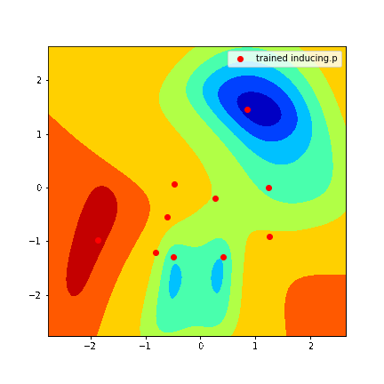
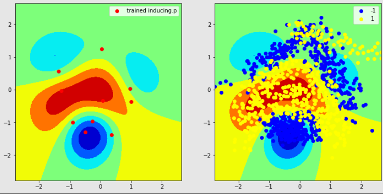

### Sparse Variational Gaussian Process (SVGP)

Naive implementation of [Sparse Variational Gaussian Process](https://proceedings.mlr.press/v38/hensman15.html) in Tensorflow.

Experimented on the `banana` dataset for classification task.

### Training

### Results

